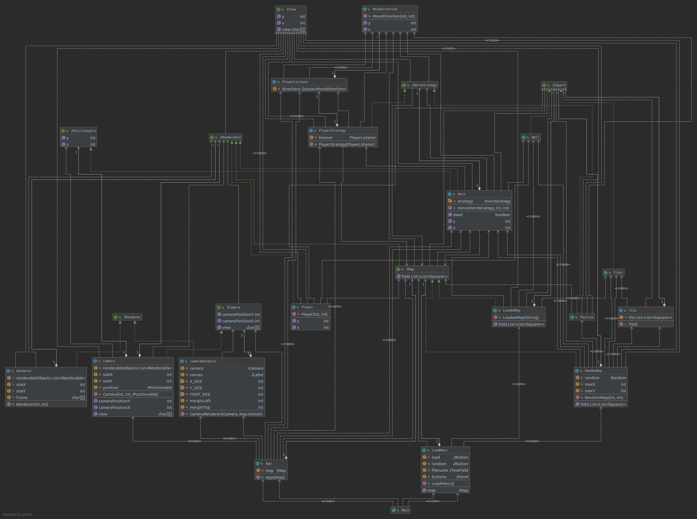

# Служебная информация
Roguelike игра с генерацией мира, частично основанная на настольной игре Dungeons and Dragons: Wrath of Ashardalon. 

### Словарь:
Моб - противник, действующей по стратегии, описанной в игре.
### Состав команды:
Вальчук Дмитрий, Ильчук Иван, Сычев Станислав

# Общие сведения о системе
Назначение системы: система имеет развлекательный характер, целевая аудитория - фанаты ролевой системы Dungeons and Dragons.
Roguelike игра, за основу которой взята настольная игра Dungeons and Dragons: Wrath of Ashardalon. Игра предполагает одиночное прохождение, заключается в прохождении серии подземелий, после каждого из которых пользователь встречается с боссом. Игра завершается при победе игроком финального босса.

# Architectural drivers
Требования к системе: должна запускаться на компьютере на операционных системах Windows, Linux.  
Игра является пошаговой, право первого хода всегда остается за игроком.      
Карта игры делится на тайлы, каждый из которых представляет собой квадрат 5 на 5 клеток. Каждую клетку может занимать один игрок, либо один моб (некоторые мобы могут занимать более 1 клетки). При попытке двух персонажей занять одну клетку, они атакуют друг друга. При этом, первым атакует герой, ход которого идет в данный момент.  
Глобальные системы:
```
Система рендеринга
Система обновления состояния
Система, хранящая состояние текущей карты
Система, обрабатывающая input пользователя
```
Опишем каждую систему подробнее:

# Система рендеринга:
Класс рендеринга хранит объект Canvas и список объектов IRenderable, реализующих интерфейс:
```
	interface IRenderable {
		void render(ICanvas canvas);
	}
```
Каждую 1/60 секунды система вызывает метод render у каждого хранимого объекта на пустом объекте canvas. Таким образом, каждый объект может перерисовать свое состояние.    \
Альтернативным вариантом является рендеринг каждого объекта после изменения состояния, т.е. в пошаговом варианте после совершения пользователем некоторых действий, но это, фактически, запрещает применения IDLE анимаций для персонажа главного героя и мобов. Поэтому было принято решения вынести систему рендеринга и сделать ее независимой от систем обновления состояния объектов и системы, обрабатывающей ввод пользователя.

# Система обновления состояния:
	Класс, аналогичный системе рендеринга. Хранит список объектов IUpdatable, реализующих интерфейс
		interface IUpdatable {
			void update(long timestamp);
		}
Через константный промежуток времени вызывает метод update у каждого хранимого объекта на текущем таймстемпе. Таким образом, каждый объект может обновить свое состояние.  
Альтернативным вариантом является обновление каждого объекта непосредственно перед обновлением, но тогда частота обновления кадров будет влиять на скорость игры. Поэтому, было принято решение вынести обновление состояния в отдельную систему.

# Система обрабатывающая input пользователя:
Singleton объект, со следующими методами:
```
    void pressed(int keyCode);
    bool isPressed(int keyCode);
```
Метод pressed вызывается при нажатии пользователем на каждую клавишу с соответствующим keyCode. Данная система также реализует интерфейс IUpdatable и при каждом вызове метода update(..) обнуляет значение всех нажатых за это время клавиш.

# Система, хранящая состояние текущей карты:
Карта генерируется в процессе игры по правилам Dungeons and Dragons: Wrath of Ashardalon. Затем, в течение игры, карта хранит ссылку на героя, который находится в ячейке с координатами x, y. Таким образом, система, хранящая состояние текущей карты имеет следующие методы:
```
    isAvailable(x: int, y:int): bool
    getHero(x:int, y:int): Hero
```

# Работа системы:
Таким образом, работа системы заключается в последовательном вызове у всех объектов системы либо метода update, либо метода render. А также синхронной обработке ввода пользователя.

# Обработка действий моба:
Занимается передвижением по одной из стратегий, основанной на настольной игрой Dungeons and Dragons: Wrath of Ashardalon. При этом, ход совершается только в случае совершения хода игроком. При столкновении с главным героем, атакует его. Таким образом, класс обработки каждого моба имеет следующие методы:
```
    void render(ICanvas);
    void update(long);
    void attacked(int damage);
```

# Обработка действий игрока:
При каждом вызове метода udpate, класс, обрабатывающий действия игрока запрашивает у системы, обрабатывающей input пользователя, какие кнопки были нажаты. Если были нажаты одна из кнопок: W, A, S, D, совершается ход. При котором герой перемещается на соответствующую клетку на карте.

# Use-case


# Components


# classes



# State Diagram


# State Machine Diagram

