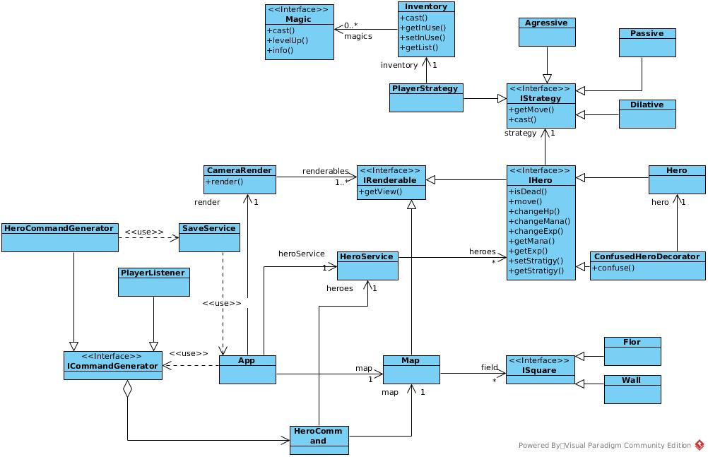

# Служебная информация
Roguelike игра с генерацией мира, частично основанная на настольной игре Dungeons and Dragons: Wrath of Ashardalon. 

### Словарь:
Моб - противник, действующей по стратегии, описанной в игре.
Тайл - части на котрые разбита карта, 4x4 клетки.
### Состав команды:
Вальчук Дмитрий, Ильчук Иван, Сычев Станислав

# Общие сведения о системе
Назначение системы: система имеет развлекательный характер, целевая аудитория - фанаты ролевой системы Dungeons and Dragons.
Roguelike игра, за основу которой взята настольная игра Dungeons and Dragons: Wrath of Ashardalon. 
Игра предполагает одиночное прохождение, заключается в прохождении и зачистки подземелий. 
Игра завершается при смерти игрока.

# Игровой процесс
Игрок находится на начальном тайле со стеной слева, и может ходить и открывать новые тайлы с монстрами.
Некоторые из них захотят сразу убить игрока, по этому есть возможность ударить монстра при попытке пойти в клетку с ним.
Так же есть магия и инвентарь с ней.

# Типичные пользователи
1) Фанат DnD, 20-40 лет, который не может собрать людей поиграть в люьимую игру.
2) Студент магистратуры, 23 года, получил задание сделать игру.
3) Преподаватель 20-40 лет, любит жанр roguelike, задал студентам сделать игру.

# Architectural drivers
Требования к системе: должна запускаться на компьютере на операционных системах Windows, Linux.  
Игра должна являеться пошаговой, право первого хода всегда остается за игроком.      
Карта игры должна делится на тайлы 
Должен быть предусмотрен консольный интерфейс для вывода игры на экран.
Должны сущществовать различные виды монстров.

Система должна работать быстро, работать без ошибок не мение пары часов, иметь простое управление.

Глобальные системы:
```
Система рендеринга
Система обновления состояния
Система, хранящая состояние текущей карты
Система, обрабатывающая input пользователя
```
Опишем каждую систему подробнее:

# Система рендеринга:
Класс рендеринга хранит 2 объекта Canvas и список объектов IRenderable, реализующих интерфейс:
```
	interface IRenderable {
		void render(ICanvas canvas);
	}
``` 
Рендеринг каждого объекта происходит после изменения состояния, т.е. после совершения пользователем хода.
Для плавности прорисовки два канваса находятся друг на друге, один из них невидим. На невидимом происходит подгатовка новой картинки и затем канвасы меняются видимостью.

# Система обновления состояния:
	Класс, аналогичный системе рендеринга. Хранит список объектов IUpdatable, реализующих интерфейс
		interface IUpdatable {
			void update(long timestamp);
		}
После хода игрока запускает по циклу запросы ко всем героям на карте сделать ход.

# Система обрабатывающая input пользователя:
Класс `PlayerListener` наследник `KeyListener`. Является частью окна игры. 
При нажатии кнопки создает `MoveAction` игрока.

# Система, хранящая состояние текущей карты:
Карта генерируется в процессе игры по правилам Dungeons and Dragons: Wrath of Ashardalon. 
Отдельно от есть хранилище персонажий `HeroesService`, через который можно понять где герой и есть ли моб впереди.

# Работа системы:
Таким образом, работа системы заключается в обработке действий игрока и запуске ходов мобов и обновлении после этого.

# Обработка действий моба:
Занимается передвижением по одной из стратегий, основанной на настольной игрой Dungeons and Dragons: Wrath of Ashardalon. При этом, ход совершается только в случае совершения хода игроком. При столкновении с главным героем, атакует его.
Кроме этого есть декораторы на героев реализующие наложенные заклинания, например конфузия.

# Use-case


# Диаграмма компонент


# Диаграмма классов



# Диаграмма последовательностей


# Диаграмма состояний


В начале игра педлагает загрузится или начать новую игру.
Потом игра ждет пока игрок нажмет на кнопку. Если игрок нажал кнопку сохранения, то сохранит, если инвенторя, то откроется инвентарь.
После хода запустится обновление которое так же запустит по кругу ходы мобов и рендеринг. 
Если после обновления игрок умер, закончит игру.